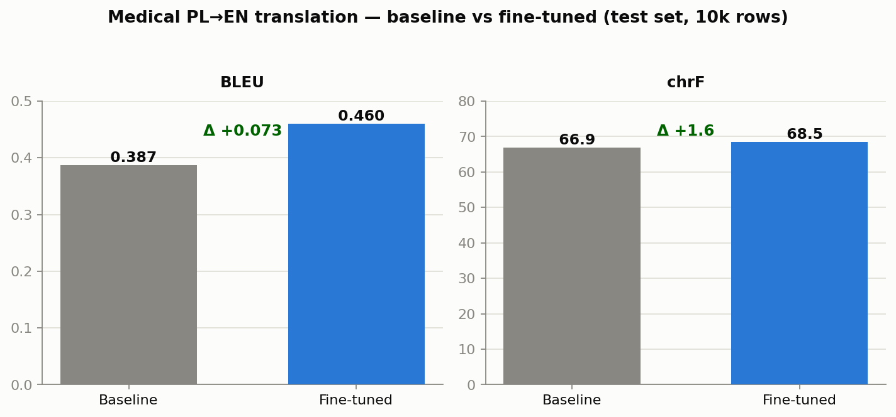

# Medical PL→EN Neural Machine Translation

Fine-tuning [`Helsinki-NLP/opus-mt-pl-en`](https://huggingface.co/Helsinki-NLP/opus-mt-pl-en)
(MarianMT) for **Polish → English translation of medical text** (drug leaflets,
adverse-reaction descriptions, clinical/veterinary phrasing).

The base OPUS-MT model is general-domain; this project adapts it to medical
Polish so domain terminology and phrasing translate more faithfully.

---

## Model architecture

MarianMT encoder–decoder Transformer (from `config.json`):

| Property | Value |
|---|---|
| Type | Marian (encoder–decoder, `is_encoder_decoder=true`) |
| Encoder / decoder layers | 6 / 6 |
| Model dim (`d_model`) | 512 |
| Attention heads | 8 (enc & dec) |
| Feed-forward dim | 2048 |
| Vocab size | 63430 (shared enc/dec embeddings) |
| Max position embeddings | 512 |
| Activation | swish |
| Dropout | 0.1 |
| Weights dtype | float32 (fp16 mixed precision at train time) |

---

## Dataset

Parallel Polish–English medical corpus, headerless CSV, two columns
(`polish`, `english`):

| Split | Full file | Working file (used for the run) |
|---|---|---|
| Train | `data_training.csv` | `data_training_short.csv` |
| Validation | `data_validation.csv` | `data_validation_short.csv` |
| Test | `data_testing.csv` | `data_testing_short.csv` |

`shortendata.py` produces the `_short` working files (`truncate(before=0,
after=9999)`, i.e. the first 10,000 rows). Preprocessing tokenizes source and
target to `max_length=128` with truncation and padding to max length
(`data_utils.py`).

---

## Training approach

**Full fine-tuning** — all model weights updated (no LoRA/QLoRA/adapters, no
quantization). Hugging Face `Seq2SeqTrainer`.

| Hyperparameter | Value |
|---|---|
| Strategy | Full fine-tune |
| Epochs | 3 |
| Batch size | 8 (train & eval, per device) |
| Learning rate | 5e-5 (linear decay to ~0) |
| Weight decay | 0.01 |
| Precision | fp16 mixed precision |
| Generation eval | `predict_with_generate=True` |
| Checkpointing | per epoch, `save_total_limit=2` |
| Model selection | `load_best_model_at_end=True`, `metric_for_best_model="bleu"` |

Best checkpoint is saved to `./finetuned-marian-best`.

> These hyperparameters are the actual experiment and are preserved exactly.
> This overhaul only added instrumentation, evaluation persistence, and docs.

---

## Results



*Regenerate with `python make_results_plot.py` (reads `results.json`).*

### Validation (per epoch — real numbers from the training run)

| Epoch | Mean train loss ↓ | Eval loss ↓ | BLEU ↑ |
|---|---|---|---|
| 1 | 0.2032 | 0.1676 | 0.3937 |
| 2 | 0.1466 | 0.1588 | **0.4308** ← best |
| 3 | 0.1188 | 0.1558 | 0.4213 |

BLEU peaked at **0.4308** (epoch 2); epoch 3 BLEU dropped (mild overfitting),
so `load_best_model_at_end` correctly kept the epoch-2 checkpoint. These exact
numbers are stored in `training_log.json`. (chrF is `null` there because the
recorded run predates the chrF addition; a fresh training run populates it.)

### Test set — baseline vs fine-tuned (BLEU + chrF)

Real numbers on `data_testing_short.csv` (10,000 rows), written to
`results.json` by `run_eval.py`:

| Model | BLEU (0–1) ↑ | chrF (0–100) ↑ |
|---|---|---|
| Baseline (`opus-mt-pl-en`) | 0.3871 | 66.89 |
| Fine-tuned | **0.4602** | **68.46** |
| **Δ (improvement)** | **+0.0731** | **+1.58** |

Fine-tuning lifts test BLEU by **+7.3 points** (0.387 → 0.460) and chrF by
**+1.58**. The large BLEU gain vs the smaller chrF gain is expected: the base
model already gets most characters right (high chrF), and fine-tuning mainly
fixes word/phrase-level medical terminology, which BLEU (n-gram based) rewards
more sharply.

> The original code only *printed* test scores to stdout, so they were never
> saved. `python run_eval.py` regenerates `results.json` (BLEU **and** chrF,
> baseline + fine-tuned + delta). chrF is included because it is more reliable
> than BLEU for morphologically rich languages like Polish and for
> medical-domain MT.

---

## How to run

### 1. Install

```bash
pip install -r requirements.txt
```

For GPU training (fp16), install a CUDA torch build — see the comment in
`requirements.txt`.

> **If your environment also has TensorFlow + Keras 3**, prefix the commands
> below with `USE_TF=0` (or `pip install tf-keras`) so Transformers loads only
> the PyTorch backend — otherwise the `Trainer` import can fail.

### 2. Train

```bash
python finetuning_best_validation.py
```

Produces `./finetuned-marian-best/`, `training_log.json`, and `results.json`.

### 3. Evaluate (standalone, no retraining)

```bash
python run_eval.py
```

Loads the base and fine-tuned models, scores the test set (BLEU + chrF), and
writes `results.json`.

**No private data?** A small curated `data_sample.csv` (20 medical PL→EN pairs)
is committed so the pipeline runs out of the box:

```bash
python run_eval.py --test_csv data_sample.csv --out sample_results.json
```

This is a smoke test, not a benchmark — the headline numbers above come from
the full 10k-row test set.

### 4. Translate a sentence

```bash
python inference.py
python inference.py --sentence "Pacjent zgłasza silne bóle głowy i nudności."
```

---

## Project layout

| File | Purpose |
|---|---|
| `finetuning_best_validation.py` | **Single source of truth** — training + eval + persistence |
| `run_eval.py` | Standalone baseline-vs-fine-tuned evaluation → `results.json` |
| `inference.py` | Load fine-tuned model and translate a Polish sentence |
| `data_utils.py` | Shared dataset loading / preprocessing |
| `metrics_utils.py` | BLEU + chrF computation and JSON persistence |
| `make_results_plot.py` | Render `assets/results.png` from `results.json` |
| `data_sample.csv` | 20-row curated demo sample (only data committed) |
| `shortendata.py` | Build the `_short` working splits |
| `check_file_length.py` | Row-count utility |
| `datatesting.py` | **DEPRECATED** (early training script; exits immediately) |
| `test.py` | Legacy scratch demo — superseded by `inference.py` |

---

## What I'd do next

- **LoRA / QLoRA experiment** — parameter-efficient fine-tuning to cut memory
  and enable larger effective batch sizes / faster iteration; compare quality
  vs the current full fine-tune at a fraction of the trainable parameters.
- **COMET metric** — add a learned, embedding-based MT metric
  (`unbabel-comet`) alongside BLEU/chrF; it correlates far better with human
  judgment for domain MT than surface-overlap metrics.
- **Larger / cleaner dataset** — train on the full (non-truncated) corpus,
  add medical-terminology-focused data, and consider back-translation
  augmentation to improve coverage of rare clinical terms.
